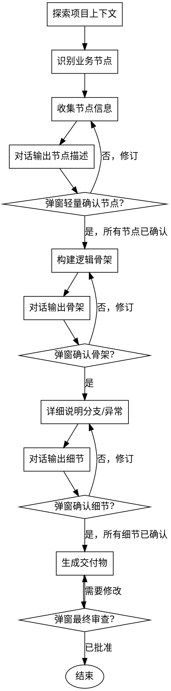

# 三步梳理法：复杂业务场景分析

通过协作对话和系统化推理，将复杂业务场景转化为清晰、经过验证的逻辑链。

**核心能力**：结合 brainstorming 的探索能力 + sequence-thinking 的推理能力 + AskUserQuestion 的轻量确认。

<HARD-GATE>
在开始分析前，必须先探索项目上下文（读取文件、搜索代码、查看实现）。禁止仅基于用户描述就开始分析。
</HARD-GATE>

## 反模式："只听描述不看代码"

每个业务分析都必须基于实际代码。用户描述可能不完整或有偏差，只有读取代码才能理解真实逻辑。分析前必须：
- 读取相关文件
- 搜索关键函数和接口
- 查看实现细节
- 然后才基于代码给出结论

## 反模式："把长描述塞进弹窗"

AskUserQuestion 是**快速选择器**，不是内容展示器。

| 正确 | 错误 |
|------|------|
| 对话/Read 输出完整节点描述（支持换行、列表、代码） | 把接口路径、逻辑、触发链路塞进 `question` |
| 弹窗只问短确认句 + 2–4 个短选项 | 问题本身含多行列表/嵌套结构 |
| 选项是简短决策（正确/有遗漏/有偏差） | 选项里再塞业务细节 |

> **借鉴 brainstorming**：先在对话中呈现完整信息，再用弹窗做轻量确认。内容展示与确认决策必须分离。

## 检查清单

你**必须**为以下每项创建任务并按顺序完成：

1. **探索项目上下文** — 读取相关文件、搜索关键代码、查看实现细节
2. **识别业务节点** — 基于代码分析，分解为离散的逻辑节点
3. **收集节点信息** — 基于代码，收集输入、输出、前置条件、后置条件、执行方
4. **确认每个节点** — **先对话输出格式化节点描述，再**用 AskUserQuestion 做轻量确认
5. **构建逻辑骨架** — 使用 sequence-thinking 将已确认的节点连接成推理链
6. **确认骨架** — **先对话输出完整骨架，再**用 AskUserQuestion 获得批准
7. **详细说明分支和异常** — 基于代码扩展逻辑，包括分支条件和错误处理
8. **确认细节** — **先对话输出细节，再**用 AskUserQuestion 获得批准
9. **生成交付物** — 生成文档、流程图或时序图
10. **最终审查** — **先对话给出交付物路径/摘要，再**用 AskUserQuestion 请用户审查

## 流程图



**终止状态是用户批准最终交付物。** 在用户批准分析之前，禁止进入实施或其他技能。

## 核心协作原则（最高优先级）

> **模型每完成一个逻辑节点的梳理，必须：**
> 1. **先在对话中输出格式化理解摘要**（完整、可读、可换行）
> 2. **再用 AskUserQuestion 做轻量确认**（短问题 + 短选项）
> 3. 确认后方可继续下一步
>
> 禁止连续输出多个节点后再等待反馈。此原则贯穿整个三步流程。
>
> **禁止**把节点描述、接口路径、多行列表直接写进 AskUserQuestion 的 `question` 字段。

## 内容与确认分离（强制模式）

所有确认环节统一为两步：

### 步骤 1：对话输出（内容展示）

在普通回复中输出结构化内容，支持标题、列表、代码路径：

```text
===== 节点 1：分配项目负责人 =====
接口：/common/setOutsourcePrincipal
逻辑：更新 bp_epiboly_project 表 + 委托单表
触发：用户点击按钮 → 弹出人员选择 → 提交
依据：CommonServiceImpl#setOutsourcePrincipal
==================================
```

### 步骤 2：AskUserQuestion（轻量确认）

弹窗只承载决策，不承载内容：

```text
问题：以上节点 1 的理解是否正确？
选项：
- 正确，继续
- 有遗漏，需补充
- 有偏差，需修正
```

### 弹窗字段约束

| 字段 | 约束 | 示例 |
|------|------|------|
| `question` | 一句短确认问句，≤ 40 字，无列表/无接口细节 | 「以上节点 1 的理解是否正确？」 |
| `header` | ≤ 12 字标签 | 「节点1确认」 |
| `options[].label` | 1–8 字决策词 | 「正确，继续」 |
| `options[].description` | 可选，≤ 30 字补充说明 | 「进入下一节点」 |

**违反即视为执行错误**：若 `question` 中出现接口路径、多行 `-` 列表、触发链路箭头（`→` 串联多步），必须先改成「对话输出 + 短确认」。

---

## 流程详情

### 第一步：探索项目上下文（主动读代码）

**目标**：基于实际代码理解业务场景，而不是基于用户描述猜测。

**执行方式**：

1. **读取相关文件** — 找到用户提到的页面、组件、接口文件
2. **搜索关键代码** — 搜索关键函数、接口、变量
3. **查看实现细节** — 阅读 Controller、Service、Mapper 实现
4. **对话整理发现** — 用可读格式输出业务节点清单

**对话输出示例**：

```text
我已读取以下文件：
- peojectManagementOfSupply.vue
- CommonController.java / CommonServiceImpl.java

基于代码分析，发现业务节点：
1. 分配项目负责人 → 接口 /common/setOutsourcePrincipal
   同时更新 bp_epiboly_project 与委托单
2. 可编辑列保存 → 接口 /batchUpdate
   仅更新 bp_epiboly_project，不级联委托单
```

**弹窗确认**（内容已在上方对话输出）：

```text
AskUserQuestion:
  header: 节点清单
  question: 以上业务节点识别是否正确？
  options:
  - 正确，继续
  - 有遗漏，需补充
  - 有偏差，需修正
```

---

### 第二步：节点确认与逻辑构建（逐节点确认）

**目标**：基于代码分析，确认每个业务节点，使用 sequence-thinking 构建逻辑骨架。

**执行方式**：

1. **对话呈现单个节点**（完整描述放在回复正文，不要塞进弹窗）

```text
===== 节点 1：分配项目负责人 =====
接口：/common/setOutsourcePrincipal
逻辑：更新 bp_epiboly_project + 委托单
触发：用户点击按钮 → 选择人员 → 提交
依据文件：CommonServiceImpl.java
==================================
```

2. **弹窗轻量确认**（每个节点一次）

```text
AskUserQuestion:
  header: 节点1确认
  question: 以上节点 1 的理解是否正确？
  options:
  - 正确，继续
  - 有遗漏，需补充
  - 有偏差，需修正
```

3. **使用 sequence-thinking 构建骨架** — 所有节点确认后，连接成推理链

4. **对话输出骨架全文**，再弹窗确认转换关系

```text
# 对话输出
整体流程：
用户编辑可编辑列 → 点击保存 → 调用 batchUpdate → 更新 bp_epiboly_project
（不级联委托单；与按钮路径行为不一致）

# 弹窗
header: 骨架确认
question: 以上整体流程是否符合实际？
options:
- 符合，继续
- 有遗漏，需补充
- 有偏差，需修正
```

---

### 第三步：提供选项与固化输出（用户选择后再生成）

**目标**：基于分析结果，用 AskUserQuestion 提供方案选项，再生成交付物。

**执行方式**：

1. **对话先写差异分析**，弹窗再给方案选择

```text
# 对话输出
差异分析：
- 按钮路径：setOutsourcePrincipal 会级联更新委托单
- 可编辑列路径：batchUpdate 不级联，导致数据不一致

# 弹窗（方案选择：选项本身是决策，可稍具体，但仍保持短 label）
header: 修复方案
question: 请选择修复方案？
options:
- A：改 batchUpdate 加级联
- B：前端改调专用接口
- C：其他方案（说明）
```

说明：方案选项的 label 可以带方案名（A/B/C），但**差异细节必须写在对话里**，不要塞进 `question`。

2. **用户选择后生成交付物**

3. **最终审查**：对话给出文档路径/摘要 → 弹窗确认

```text
AskUserQuestion:
  header: 交付审查
  question: 文档是否可以定稿？
  options:
  - 无问题，完成
  - 有修改，需说明
```

---

## 硬性规则（必须遵守）

### 规则 1：先读代码再分析

在开始分析前，必须先探索项目上下文（读取文件、搜索代码、查看实现）。禁止仅基于用户描述就开始分析。

### 规则 2：基于代码给出结论

所有分析结论必须基于实际代码，而不是猜测。如果代码中找不到相关信息，必须告知用户。

### 规则 3：内容与确认分离（可读性硬规则）

所有确认环节必须：
1. **先**在对话中输出完整、格式化内容
2. **再**用 AskUserQuestion 做轻量确认（短问题 + 短选项）

禁止把节点描述、接口路径、多行列表写进 `question`。AskUserQuestion 只做决策，不做展示。

### 规则 4：使用 sequence-thinking 构建逻辑骨架

在第二步中，必须使用 sequence-thinking 工具将已确认的节点连接成推理链。

### 规则 5：强制确认循环

- 每个节点：对话输出 → AskUserQuestion 确认
- 用户修正后，重新执行该节点推理（最多 3 次循环）
- 超过 3 次仍未确认，记录待确认项并继续

### 规则 6：捆绑调用

- brainstorming 贯穿全程，持续提问和收集信息
- sequence-thinking 在第二步用于构建逻辑骨架
- AskUserQuestion 用于所有确认环节（仅轻量确认）
- 禁止只调用一个技能就进入下一步

---

## 关键原则

- **先读代码再分析** — 不要基于描述猜测
- **基于代码给出结论** — 所有结论必须有代码依据
- **内容展示与确认分离** — 对话承载可读内容，弹窗只做短确认
- **使用 sequence-thinking 构建逻辑骨架** — 确保推理链有清晰依据
- **一次只问一个问题** — 不要用多个问题压倒用户
- **增量验证** — 呈现理解，获得批准后再继续
- **保持灵活** — 如果有不合理的地方，回头澄清

---

## 适用场景速查

| 场景 | 指令切入点 |
|------|-----------|
| 现有代码太乱，想理清脉络 | "先读取相关文件，搜索关键代码，基于代码分析业务流程，每确认一个节点后再继续。" |
| 跨系统交互逻辑梳理 | "先读取各系统的接口文件，基于代码分析交互逻辑，每确认一方后再串联时序。" |
| 梳理完生成可视化图表 | "基于代码分析生成推理链，确认后再转化为 Mermaid 流程图代码。" |
| 复杂业务场景分析 | "先探索项目上下文，基于代码识别业务节点，逐节点确认后生成文档。" |

---

## 输出要求

### 最终交付物

- **业务逻辑说明文档**：基于代码分析，包含所有节点、流转关系、差异分析、修复建议
- **流程图代码**：Mermaid 格式，可直接渲染
- **时序图**：如涉及系统间交互，生成时序图

### 中间交付物（可选）

- **节点清单**：基于代码识别的所有业务节点
- **推理链**：带编号、可回溯的思维链
- **待确认项**：超过 3 次仍未确认的问题

---

## 示例流程

### 示例：分析"委外供管页面的可编辑列保存逻辑"

**第一步：探索项目上下文**

1. 读取 Vue 文件、搜索按钮事件、读取接口实现（略）

2. **对话输出节点清单**（完整可读）：

```text
基于代码分析，识别业务节点：
1. 分配项目负责人按钮 — /common/setOutsourcePrincipal
2. 可编辑列保存 — /batchUpdate
```

3. **弹窗轻量确认**：

```text
header: 节点清单
question: 以上业务节点识别是否正确？
options:
- 正确，继续
- 有遗漏，需补充
- 有偏差，需修正
```

**第二步：节点确认与逻辑构建**

1. **对话输出节点 1 详情**，再弹窗：

```text
# 对话
===== 节点 1：分配项目负责人 =====
接口：/common/setOutsourcePrincipal
逻辑：更新 bp_epiboly_project + 委托单
触发：用户点击按钮 → 选择人员 → 提交
==================================

# 弹窗
header: 节点1确认
question: 以上节点 1 的理解是否正确？
options:
- 正确，继续
- 有遗漏，需补充
- 有偏差，需修正
```

2. 使用 sequence-thinking 构建骨架

3. **对话输出骨架**，再弹窗确认：

```text
# 对话
整体流程：用户编辑可编辑列 → 点击保存 → 调用 batchUpdate → 更新 bp_epiboly_project

# 弹窗
header: 骨架确认
question: 以上整体流程是否符合实际？
options:
- 符合，继续
- 有遗漏，需补充
- 有偏差，需修正
```

**第三步：提供选项与固化输出**

1. **对话输出差异**，弹窗选方案：

```text
# 对话
差异：按钮操作会级联更新委托单，可编辑列保存不会。

# 弹窗
header: 修复方案
question: 请选择修复方案？
options:
- A：改 batchUpdate 加级联
- B：前端改调专用接口
- C：其他方案（说明）
```

2. 用户选择后生成文档

3. **最终弹窗审查**：

```text
header: 交付审查
question: 文档是否可以定稿？
options:
- 无问题，完成
- 有修改，需说明
```
